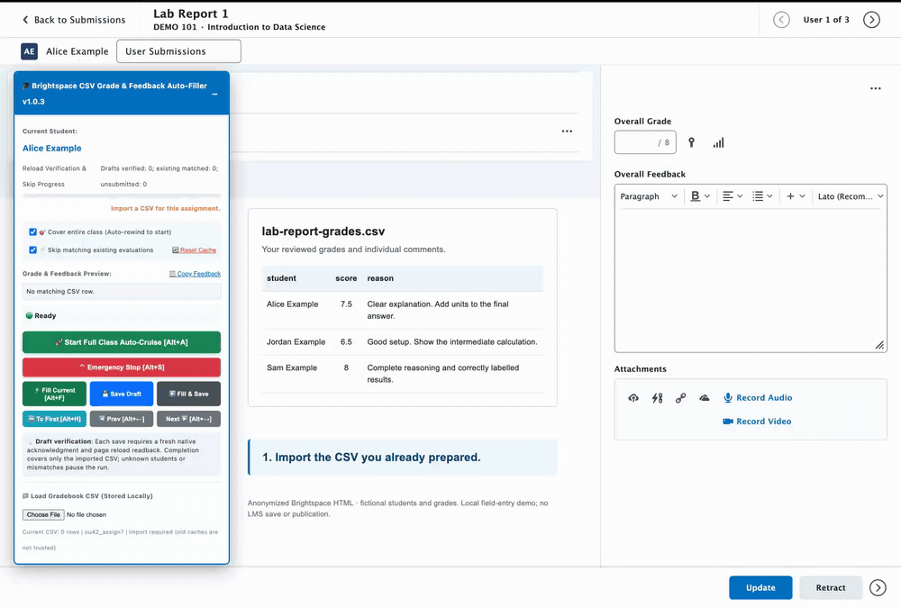

# 🎓 Brightspace (D2L) CSV Grade & Feedback Auto-Filler

[](LICENSE)
[](brightspace_auto_feedback_injector.user.js)
[](brightspace_auto_feedback_injector.user.js)
[](#-privacy--local-execution)
[](CONTRIBUTING.md)

> **Stop copy-pasting grades and feedback into Brightspace.** Built for Teaching Assistants (TAs) working through assignment queues, lab reports, and autograder results. Bring your reviewed scores and personalized comments from CSV into **D2L Brightspace Consistent Evaluation**. Instructors are welcome too.

Free and open-source, with no tracking or third-party uploads. One script, no programming required. Install it with Violentmonkey or Tampermonkey—no Node, npm, or test files needed.

[**Get the script**](#step-2-install-this-userscript) · [**Project homepage & video**](https://quang-Ivan.github.io/brightspace-grade-assistant/#demo) · [**User guide**](docs/USER_GUIDE.md)

## 🎬 See it in action

[](https://quang-Ivan.github.io/brightspace-grade-assistant/#demo)

[Watch the captioned video](https://quang-Ivan.github.io/brightspace-grade-assistant/#demo) · [Download the MP4](assets/demo/quick-demo.mp4)

Load a CSV → fill the current student's grade and feedback → move to the next student. Recorded with the real script on an **anonymized local copy of Brightspace's evaluation-page HTML**, using fictional students and grading data. It demonstrates field entry, not a live save or a speed benchmark.

---

## ⚡ Quick Start

**Install an extension → Install this script → Load your CSV in Brightspace**

### Step 1: Install a Userscript Manager (One-Time Setup)

Install one browser extension to run userscripts:

- [**Violentmonkey**](https://violentmonkey.github.io/) (Recommended — open-source and lightweight)
- [**Tampermonkey**](https://www.tampermonkey.net/) (Popular alternative)

> [!NOTE]
> **Chrome 138+ / Tampermonkey 5.3+ Notice**: In Chromium-based browsers, ensure **"Developer mode"** is enabled in `chrome://extensions` or toggle on **"Allow User Scripts"** in the extension details page so userscripts are permitted to run. See the [permission walkthrough](docs/USER_GUIDE.md#1-install-a-userscript-manager).

### Step 2: Install This Userscript

**Greasy Fork will be the main installation source.** Once the listing is available, open it, click **Install this script**, then confirm **Install** in your extension.

<!-- GREASY_FORK_URL: Replace the pending-listing line below with the actual script listing after publication. -->
👉 **Greasy Fork listing: coming soon.**

For now, use the [v1.0.3 source file](brightspace_auto_feedback_injector.user.js) and the [manual installation steps](docs/USER_GUIDE.md#2-install-this-script). Keep only one copy of the helper enabled.

### Step 3: Grade in Brightspace!

1. Log into your university's Brightspace as a TA or instructor with assignment-grading permission.
2. Go to your course ➔ **Assignments** ➔ Click on any student submission to enter **Consistent Evaluation**.
3. The blue **🎓 Brightspace CSV Grade & Feedback Auto-Filler** panel appears in the bottom-right corner!
4. Click **📁 Load Gradebook CSV** and select your CSV file.
5. Check the student and preview. On your first run, try **Fill Current → Save Draft** on one unpublished submission and check the result after the page refreshes.
6. Click **🚀 Start Full Class Auto-Cruise** (or press <kbd>Alt</kbd> + <kbd>A</kbd>). Use **Emergency Stop** whenever you need to pause.
7. When the imported rows are accounted for, a 4-note completion chime plays 🎵. Review the draft, existing-match, and unsubmitted counts before publishing.

> 📖 **First time using a userscript?** Follow the [step-by-step installation and user guide](docs/USER_GUIDE.md), including CSV preparation and troubleshooting.

---

## 💡 Key Architectural Clarifications

### 1. Does This Sync Directly to the Brightspace Gradebook?

The helper enters grades through the **assignment evaluation page**, not the Grades Import tool. If the assignment is linked to a Grade Item, Brightspace handles the connection to the Gradebook according to the course settings. Check the Grades page when confirming that setup; this script does not create or change the link.

### 2. Save Draft vs. Publish Workflow

- For unreleased assignments, the script **strictly targets "Save Draft"** (it **never** clicks "Publish" on drafts).
- After Brightspace confirms a draft save, the helper refreshes and checks the same student's score and feedback before moving on.
- Once you finish reviewing, publish separately through Brightspace's own controls and check the intended student view.
- For an already-published evaluation, the helper can **skip matching values**. If the grade or supplied feedback differs, it pauses; it never clicks **Update**.

> 📖 **Want to know more about the underlying mechanics?**  
> Read the **[In-Depth Technical Guide](docs/IN_DEPTH_GUIDE.md)** for student matching, browser storage, and the save-and-refresh workflow.

---

## 🌟 Features at a Glance

- 🔄 **Class Traversal & Progress**: Optionally rewinds to the first student, then moves forward while tracking your imported rows. A partial CSV or Brightspace filter does not silently become full-course coverage.
- 🎯 **Focused Form Filling**: Fills only Overall Grade and Overall Feedback, leaving individual rubric scores and unrelated editors alone.
- 📝 **Written Feedback with Line Breaks**: Copies ordinary text from your CSV, including multiline comments. No HTML formatting is required.
- ⚡ **Fast Skip for Existing Matches**: Skips published or previously verified evaluations when the score and any supplied feedback match. Dialogs pause the run for your review.
- ⚠️ **CSV Validation**: Rejects invalid scores and ambiguous identities. An empty score skips an unsubmitted student; **zero is a real grade**.
- 🛑 **Emergency Stop (<kbd>Alt</kbd> + <kbd>S</kbd>)**: Stops further automated actions. It cannot undo an action Brightspace has already received.
- 🎵 **Completion Chime**: Plays a pleasant 4-note chime when the imported rows are accounted for.
- 🔒 **Privacy-First Local Execution**: Zero tracking, zero analytics, and no third-party uploads. The script operates Brightspace's fields and buttons rather than making its own network calls.

---

## 📋 CSV Format Guide

The script natively accepts two CSV formats. A sample template is provided in [`sample_grades.csv`](sample_grades.csv).

### 🎯 Quick Format Selection

| Your Goal | Recommended Format | Score Filled? | Feedback Injected? |
| :--- | :---: | :---: | :---: |
| **Inject Both Scores & Detailed Feedback** (Simplest) | **Format A** (`student,score,reason`) | ✅ Yes | ✅ Yes (Built-in `reason` column) |
| **Export Roster from Brightspace, then add Feedback** | **Format B with `Feedback` column** | ✅ Yes | ✅ Yes (Add a `Feedback` column) |
| **Only Fill Numeric Scores** (No feedback needed) | **Format B Native** (Standard Brightspace export) | ✅ Yes | ⏹️ No (Score only) |

---

### Format A: Simple 3-Column CSV (Recommended)

```csv
student,score,reason
"Alice Smith",95.0,"Excellent work! Problem 1 and Problem 2 are completely correct."
"Bob Jones",88.5,"Good submission. Note: check units and label all axes on problem 2."
"Charlie Brown",,"No submission"
"Drew Example",92.0,"Part A: 50/50. Part B: 42/50. Please show the missing calculation."
```

- **`student`**: Full name matching Brightspace (e.g. `First Last` or `Last, First`).
- **`score`**: Numeric points for your assignment, not a percentage or a fraction such as `7/8`. The examples above are out of 100. **For unsubmitted students, leave the score blank; use `0` for an actual zero.**
- **`reason`**: Plaintext feedback, with CSV quoting for commas, quotes, or line breaks. Blank feedback leaves existing comments unchanged.

> [!TIP]
> You can add an **`OrgDefinedId`** column (e.g. `student,OrgDefinedId,score,reason`) using the values from your official course export. See the [student-ID guide](docs/IN_DEPTH_GUIDE.md#using-student-ids) if two students share a name.

---

### Format B: Brightspace Roster Export Format

Brightspace's native Gradebook Export (`Grades ➔ Export`) produces a format containing `OrgDefinedId`, `Last Name`, `First Name`, and numeric points columns:

```csv
OrgDefinedId,Last Name,First Name,Homework 1 Points Grade <Numeric MaxPoints:100>,Feedback,End-of-Line Indicator
#112233445,Smith,Alice,95.0,"Excellent work! All answers completely correct.",#
#112233446,Jones,Bob,88.5,"Good job. Note: check units on problem 2.",#
#112233447,Brown,Charlie,,No submission,#
```

> [!IMPORTANT]
> Keep **one target grade column**, with its exact heading from the official export. The heading above is an example. Preserve OrgDefinedId values, including leading zeros.
> An ID mismatch stops the run. If the page does not expose an ID, the student's displayed name must identify exactly one CSV row.

> [!WARNING]
> **Format B with `Feedback` is a Userscript-Specific Format**:
>
> - Adding a `Feedback` column is designed specifically for **this userscript**.
> - Load this file in the helper panel, **not** Brightspace's native `Grades ➔ Import` tool. The two import formats serve different purposes.

---

## 🛠️ How to Prepare Your CSV (3 Workflows)

<details>
<summary><strong>Click to expand 3 simple CSV preparation workflows</strong></summary>

### Workflow 1: From Brightspace Export (Zero Manual Typing of Names)

1. In Brightspace, go to **Grades** ➔ **Enter Grades** ➔ **Export**.
2. Under **Key Field**, select `OrgDefinedId` (or `Both`). Check `Last Name` and `First Name`.
3. Under **Choose Grades to Export**, check your target Assignment (e.g. `Homework 1`).
4. Click **Export to CSV**.
5. Open in Excel, enter scores, add a `Feedback` column if desired, and save as CSV!

### Workflow 2: From Excel or Google Sheets (Quick 3-Column Spreadsheet)

1. Open Excel or Google Sheets.
2. Put `student`, `score`, and `reason` in the first row.
3. Fill in student names, scores, and comments (leave unsubmitted scores blank).
4. Save a **CSV UTF-8 (comma-delimited)** copy, not an `.xlsx` workbook.

### Workflow 3: Automated Python / Jupyter / Autograder Workflow

TAs running autograders can export results directly:

```python
import csv

results = [
    {"name": "Alice Smith", "score": 98.0, "feedback": "All test cases passed!"},
    {"name": "Bob Jones", "score": 85.0, "feedback": "Problem 3 failed test case 2."},
    {"name": "Charlie Brown", "score": None, "feedback": "No submission"}
]

with open("grades.csv", "w", newline="", encoding="utf-8") as f:
    writer = csv.writer(f)
    writer.writerow(["student", "score", "reason"])
    for r in results:
        writer.writerow([r["name"], r["score"] if r["score"] is not None else "", r["feedback"]])
```
</details>

---

## ⌨️ Keyboard Shortcuts

| Shortcut | Action | Description |
| :---: | :--- | :--- |
| <kbd>Alt</kbd> + <kbd>A</kbd> | **Toggle Auto-Cruise** | Starts continuous automated grading or pauses execution |
| <kbd>Alt</kbd> + <kbd>S</kbd> | **Emergency Stop** | Stops further automated actions |
| <kbd>Alt</kbd> + <kbd>H</kbd> | **Rewind to First** | Rapidly navigates backwards to Student #1 |
| <kbd>Alt</kbd> + <kbd>F</kbd> | **Fill Current Student** | Fills the fields without clicking Save Draft or advancing |
| <kbd>Alt</kbd> + <kbd>→</kbd> | **Next Student** | Deep-clicks the Brightspace Next Student button |
| <kbd>Alt</kbd> + <kbd>←</kbd> | **Previous Student** | Deep-clicks the Brightspace Previous Student button |

---

## ❓ Frequently Asked Questions (FAQ)

<details>
<summary><strong>Q: How do I import grades and personalized feedback from CSV into Brightspace?</strong></summary>
Prepare a CSV with student names or IDs, one score column, and a <code>reason</code> or <code>Feedback</code> column. Load it in this helper on an assignment evaluation page, check the preview, then fill and verify one unpublished submission before running the rest. This fills the assignment's Overall Grade and Overall Feedback; it is separate from Brightspace's native Grades Import.
</details>

<details>
<summary><strong>Q: Can TAs bulk enter assignment feedback in D2L?</strong></summary>
Yes, if your TA account has permission to evaluate that assignment and the page uses supported controls. Each CSV row can contain its own comment. Use manual controls for a few students or Auto-Cruise for your reviewed rows; the helper does not grant extra permissions or publish results.
</details>

<details>
<summary><strong>Q: Is this an AI grader?</strong></summary>
No. You decide the scores and feedback. The helper handles repetitive data entry from a CSV exported by Excel, Google Sheets, Python, or an autograder whose results you have reviewed.
</details>

<details>
<summary><strong>Q: Does this work on my university's Brightspace website?</strong></summary>
The script recognizes Brightspace page paths on standard and custom school domains. It is designed for the English-language Consistent Evaluation layout. If a school uses different controls or wording, the helper may pause rather than fill the wrong field.
</details>

<details>
<summary><strong>Q: Will Brightspace detect or ban this?</strong></summary>
It is an assistive script that fills and clicks the existing page, not a separate grading service. Use it within your institution's rules; the project cannot promise how every institution treats automation.
</details>

<details>
<summary><strong>Q: What happens if a student did not submit their assignment?</strong></summary>
A blank score in your CSV marks an unsubmitted student to skip. A student missing from the CSV is different: Auto-Cruise pauses. For a submitted student you have not graded yet, leave the row out and use manual controls for the rows you are ready to process.
</details>

<details>
<summary><strong>Q: What if the evaluation is already published?</strong></summary>
The helper never clicks Update. With fast skip enabled, matching grade and feedback are skipped; a mismatch pauses for your review. A just-filled entry is not treated as an existing saved match.
</details>

## 🔒 Privacy & Local Execution

The script runs locally in your browser: **no direct network/API calls, no analytics, and no third-party uploads**. It fills fields and clicks controls; Brightspace handles communication with its own servers, as it does during manual grading.

Your CSV and progress are stored under the school's website in your browser, separated by course and assignment. **Reset Cache** removes that helper data for the current assignment; it does not remove Brightspace grades. Keep real student data out of public issues, screenshots, and sample files.

## ✅ Testing & Current Scope

v1.0.3 has 34 automated regression checks, a simulated browser workload, and real Brightspace checks for filling, navigation, fast skip, and pausing on published mismatches. The complete **Save Draft → refresh → verify** path has been exercised in simulation; its real unpublished-evaluation check remains outstanding. See the [test results](docs/LOCAL_VALIDATION.md) for details.

---

## 🤝 Contributing

Contributions are welcome! Please read [CONTRIBUTING.md](CONTRIBUTING.md) before submitting pull requests.

## 📄 License

This project is licensed under the [MIT License](LICENSE).
